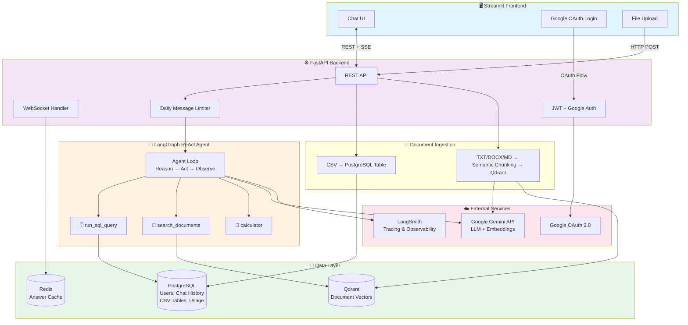
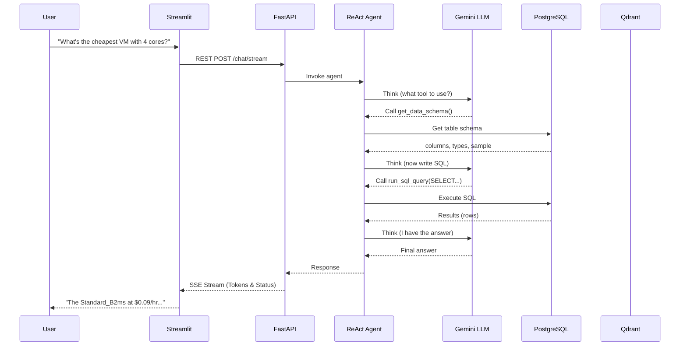
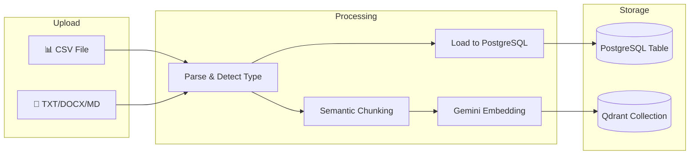

# 🤖 GenAI Multi-Agent Chatbot

A production-ready AI chatbot powered by **Google Gemini** and **LangGraph**, featuring a ReAct agent with SQL querying, document Q&A (RAG), and real-time WebSocket communication.

## Architecture



## Features

### Query Flow



### Document Ingestion Flow



- **ReAct Agent** — Iterative reasoning + acting loop using LangGraph
- **SQL Querying** — Upload CSVs, auto-loaded into PostgreSQL, queryable via natural language
- **RAG (Document Q&A)** — Upload TXT/DOCX/MD/PDF files, hierarchical/semantic chunking, structure-aware extraction, vector search via Qdrant
- **Semantic Chunking** — Adaptive threshold based on content type (technical vs prose)
- **Incremental Embedding** — Re-uploads only re-embed changed chunks (cost optimization)
- **Ultra-Low Latency Streaming** — Server-Sent Events (SSE) capture LangGraph `on_chat_model_stream` events for real-time true token streaming with ~1s TTFB
- **High-Concurrency Background Processing** — CPU-bound chunking and I/O-bound Qdrant/PostgreSQL operations are fully offloaded to thread pools
- **Google OAuth** — Secure authentication, no passwords stored
- **Daily Message Limits** — Per-user rate limiting for cost control
- **Early Answer Caching** — Fast-path Redis cache lookups skip agent initialization and history loading entirely
- **LangSmith Tracing** — Full observability with per-user metadata tagging
- **Usage Tracking** — Token usage and costs logged to PostgreSQL

## Tech Stack

| Layer | Technology |
|-------|-----------|
| LLM | Google Gemini (via OpenAI-compatible API) |
| Agent Framework | LangGraph (ReAct pattern) |
| Backend | FastAPI + SSE |
| Frontend | Streamlit |
| Relational DB | PostgreSQL (user data, CSV tables, chat history) |
| Vector DB | Qdrant (document embeddings) |
| Cache | Redis (answer cache, embedding cache) |
| Auth | Google OAuth 2.0 + JWT |
| Embedding | Gemini Embedding 001 |
| Observability | LangSmith |

## Project Structure

```
├── run_api.py                 # Backend entry point
├── run_frontend.py            # Frontend entry point
├── setup_env.bat              # Windows setup script
├── requirements.txt           # Python dependencies
├── .env.example               # Environment template
├── docker-compose.yml         # Docker services (Postgres, Qdrant, Redis)
├── Dockerfile                 # App container
│
├── src/
│   ├── api/
│   │   ├── app.py             # FastAPI app factory
│   │   ├── auth.py            # JWT + Google OAuth verification
│   │   ├── routes.py          # REST endpoints + Google login page
│   │   ├── schemas.py         # Pydantic request/response models
│   │   └── websocket_handler.py  # WebSocket chat handler
│   │
│   ├── config/
│   │   └── settings.py        # Centralized app settings (from .env)
│   │
│   ├── database/
│   │   ├── engine.py          # SQLAlchemy async engine + init_db
│   │   ├── models.py          # ORM models (User, ChatMessage, etc.)
│   │   ├── repository.py      # Data access layer (CRUD)
│   │   └── csv_tables.py      # Dynamic CSV → PostgreSQL table loader
│   │
│   ├── frontend/
│   │   └── app.py             # Streamlit UI (login, chat, file upload)
│   │
│   ├── graph/
│   │   ├── workflow.py         # LangGraph ReAct agent builder
│   │   ├── tools_registry.py  # All agent tools (SQL, RAG, calculator)
│   │   ├── llm.py             # Gemini LLM wrapper with usage tracking
│   │   ├── usage_tracker.py   # Token/cost tracking callbacks
│   │   ├── answer_cache.py    # Redis answer caching
│   │   └── state.py           # Graph state definitions
│   │
│   └── rag/
│       ├── chunker.py         # Semantic chunking + text extraction
│       ├── embeddings.py      # Gemini embedding wrapper
│       ├── vectorstore.py     # Qdrant operations (store, query, delete)
│       └── metadata.py        # Document summary generation
```

## Prerequisites

- **Python 3.11+**
- **PostgreSQL 14+** (running locally or via Docker)
- **Qdrant** (running locally or via Docker)
- **Redis** (running locally or via Docker)
- **Docker & Docker Compose** (Recommended for 1-command startup)
- **Google OAuth Client ID** ([Setup here](https://console.cloud.google.com/apis/credentials))
- **Google Gemini API Key** (Free from [Google AI Studio](https://aistudio.google.com/apikey))
- **LangSmith API Key** (Optional, for observability from [LangSmith](https://smith.langchain.com))

---

## ⚡ Quickstart (1-Command Docker Setup)

### 1. Clone the repository

```bash
git clone https://github.com/your-username/genai-multi-agent-chat.git
cd genai-multi-agent-chat
```

### 2. Configure environment

```bash
cp .env.example .env    # Linux/Mac
copy .env.example .env  # Windows
```

Edit `.env` with your settings:
- `GOOGLE_CLIENT_ID` & `GOOGLE_CLIENT_SECRET` — from [Google Cloud Console](https://console.cloud.google.com/apis/credentials)
- `JWT_SECRET` — any random 32+ character string
- `LANGCHAIN_API_KEY` — (optional) for LangSmith tracing

> [!NOTE]
> `GEMINI_API_KEY` is **NOT** required in `.env`. Users enter their own free Google AI Studio keys in the UI (Bring Your Own Key), which are encrypted with AES-128 at rest.

### 3. Start everything with Docker

```bash
docker compose up --build -d
```

This launches all 6 containers:
- **Streamlit Frontend**: [http://localhost:8501](http://localhost:8501)
- **FastAPI Backend**: [http://localhost:8000](http://localhost:8000) (Docs: `/docs`)
- **MCP Search Server**: [http://localhost:8001/mcp](http://localhost:8001/mcp)
- **PostgreSQL**: `localhost:5432`
- **Redis Cache**: `localhost:6379`
- **Qdrant Vector DB**: [http://localhost:6333/dashboard](http://localhost:6333/dashboard)

---

## 🔑 Google OAuth Setup (2 Minutes)

1. Go to [Google Cloud Console Credentials](https://console.cloud.google.com/apis/credentials).
2. Click **Create Credentials** $\rightarrow$ **OAuth client ID** $\rightarrow$ Application type: **Web application**.
3. Under **Authorized redirect URIs**, add:
   ```text
   http://localhost:8000/auth/google/callback
   ```
4. Copy **Client ID** and **Client Secret** into your `.env` file.

---

## ☁️ Cloud Deployment Options

### Option A: Single VPS / Cloud Server (Render / Railway / DigitalOcean / AWS EC2)
1. Push your code to GitHub.
2. On your cloud server, clone the repo and create `.env`.
3. Update Google OAuth redirect URI with your server's domain/IP: `https://your-domain.com/auth/google/callback`.
4. Run `docker compose up --build -d`.

### Option B: Streamlit Community Cloud (Frontend) + Managed Backend
1. Deploy Backend and DBs (Postgres, Redis, Qdrant) on [Railway](https://railway.app) or [Render](https://render.com).
2. On [Streamlit Community Cloud](https://share.streamlit.io), connect your GitHub repo and select `src/frontend/app.py`.
3. Add the Streamlit Secret in Settings:
   ```toml
   API_BASE_URL = "https://your-backend.railway.app"
   API_BROWSER_URL = "https://your-backend.railway.app"
   ```

## Key Design Decisions

- **Qdrant over pgvector** — Dedicated vector DB for clean multi-tenant isolation (one collection per user) and separation from transactional workload
- **Semantic chunking over fixed-size** — Adaptive embedding-based boundaries produce topically coherent chunks for better retrieval
- **ReAct agent over multi-node graph** — Simpler architecture where one LLM decides tool order dynamically vs hardcoded routing logic
- **CSV → SQL path** — Structured data goes to PostgreSQL for exact queries, not into RAG where embeddings lose numeric precision
- **Asynchronous I/O & Thread Pooling** — Heavy file uploads and database writes are aggressively offloaded and pipelined via `asyncio.to_thread` and `ThreadPoolExecutor` to prevent FastAPI event loop blocking
- **Per-user daily limits** — Cost protection for deployed portfolio project

## License

MIT
