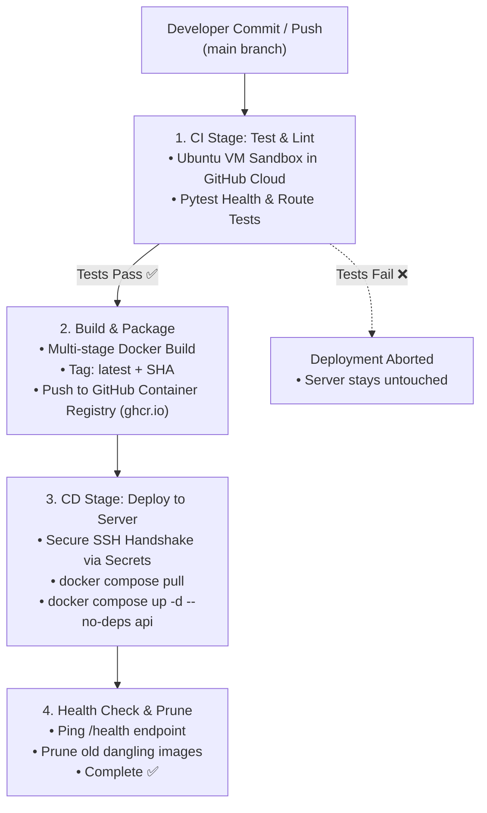

# 🚀 CI/CD Pipeline & Automated Deployment Guide

This directory contains the production CI/CD automation pipeline for the **GenAI Multi-Agent RAG Chat API**. It automates the lifecycle from **code commit**, **automated testing**, **Docker container packaging**, **GHCR registry publication**, to **zero-downtime SSH server deployment**.

---

## 📁 File Structure & Inventory

```text
cicd/
├── .github/workflows/
│   ├── deploy.yml            # Main CI/CD: Commit -> Pytest -> Docker Build -> GHCR -> SSH Deploy
│   └── eval.yml              # Scheduled / Manual Multi-Agent & RAGAS Evaluation Benchmark
├── docker-compose.server.yml # Server compose file configured to pull pre-built GHCR images
├── deploy.sh                 # Standalone bash deployment and health check verification script
├── tests/
│   └── test_api.py           # Smoke and health check tests executed during CI Stage 1
└── README.md                 # Complete setup and configuration guide
```

---

## 🏗️ Architecture & Pipeline Flow



---

## 🔑 Step 1: Configure GitHub Repository Secrets

To allow GitHub Actions to securely connect to your server and GitHub Container Registry, add the following secrets in your repository:

1. Go to your GitHub repository $\rightarrow$ **Settings** $\rightarrow$ **Secrets and variables** $\rightarrow$ **Actions**.
2. Click **New repository secret** and add each secret below:

| Secret Name | Description | Example Value |
| :--- | :--- | :--- |
| `SERVER_HOST` | Public IP or domain name of your Linux server | `159.65.120.45` or `api.yourdomain.com` |
| `SERVER_USER` | SSH login username on your server | `ubuntu`, `root`, or `ec2-user` |
| `SERVER_SSH_KEY` | Private SSH key used to log in to the server | Content of `~/.ssh/id_rsa` or `.pem` file |
| `SERVER_APP_DIR` | Absolute path on your server where the app is located | `/home/ubuntu/rag_reranker` |
| `GHCR_TOKEN` | GitHub Personal Access Token (Classic) with `read:packages` permission | `ghp_xxxxxxxxxxxxxxxxxxxx` |
| `SERVER_PORT` *(optional)* | Custom SSH Port (defaults to 22) | `22` |

---

## 🖥️ Step 2: Prepare Your Server

Execute the following commands on your Linux server once:

### 1. Enable Non-Sudo Docker Permissions
```bash
sudo usermod -aG docker $USER
newgrp docker
```

### 2. Configure SSH Authentication
On your local machine or server, generate an SSH key if you don't have one:
```bash
ssh-keygen -t rsa -b 4096 -C "github-actions-deploy"
```
Append the **public key** (`id_rsa.pub`) to `~/.ssh/authorized_keys` on your server:
```bash
cat ~/.ssh/id_rsa.pub >> ~/.ssh/authorized_keys
chmod 600 ~/.ssh/authorized_keys
chmod 700 ~/.ssh
```
Copy the **private key** (`id_rsa`) and paste it into GitHub Secret `SERVER_SSH_KEY`.

### 3. Place `.env` and `docker-compose.server.yml` on the Server
In your server's application directory (e.g., `/home/ubuntu/rag_reranker`):
```bash
mkdir -p /home/ubuntu/rag_reranker
cd /home/ubuntu/rag_reranker

# 1. Create your production .env file with live secrets:
nano .env

# 2. Copy docker-compose.server.yml to the server (or rename it to docker-compose.api.yml)
cp /path/to/docker-compose.server.yml ./docker-compose.api.yml
```

---

## 🧪 Step 3: Fast CI Tests vs Multi-Agent Eval

We separate fast CI tests from heavy LLM evaluations to save cost and time:

### A. CI Commit Pipeline (`deploy.yml`)
* **Trigger**: Automatic on `git push origin main`.
* **Execution**: Runs in GitHub Cloud (~1 minute).
* **Scope**: Fast Python unit tests in `tests/test_api.py`, checking endpoint health and startup logic without invoking costly LLM API tokens.

### B. Multi-Agent & RAGAS Benchmark (`eval.yml`)
* **Trigger**:
  * **Nightly**: Automatically runs every night at midnight UTC (`0 0 * * *`).
  * **Manual**: Click **Actions** $\rightarrow$ **Nightly Multi-Agent & RAG Evaluation** $\rightarrow$ **Run workflow** in GitHub.
* **Scope**: Executes `eval/run_eval.py` against `eval/gold_dataset.json` to calculate:
  * Router accuracy (Doc vs SQL vs Web)
  * Faithfulness & Groundedness (Hallucination detection)
  * Context Precision & Recall (Precision@K, MRR)

---

## 🔄 Step 4: Testing the Pipeline

1. **Commit and push changes to GitHub**:
   ```bash
   git add .
   git commit -m "feat: setup automated CI/CD pipeline"
   git push origin main
   ```
2. Open your repository on GitHub and click the **Actions** tab.
3. Observe the pipeline progress:
   - `Run Unit & Health Tests` (Tests pass)
   - `Build & Push Docker Image` (Image pushed to `ghcr.io`)
   - `Deploy to Server via SSH` (Server pulls and updates container)
   - `Health Check Verification` (`/health` returns 200 OK)

---

## 🛠️ Rollback & Manual Deployment

If you ever need to manually deploy or roll back on the server directly:

```bash
# To run the automated deployment script manually:
chmod +x cicd/deploy.sh
./cicd/deploy.sh

# To roll back to a specific Docker image tag:
docker compose -f docker-compose.api.yml down
docker pull ghcr.io/<your-github-username>/projects/api:<previous-git-sha>
docker compose -f docker-compose.api.yml up -d
```
